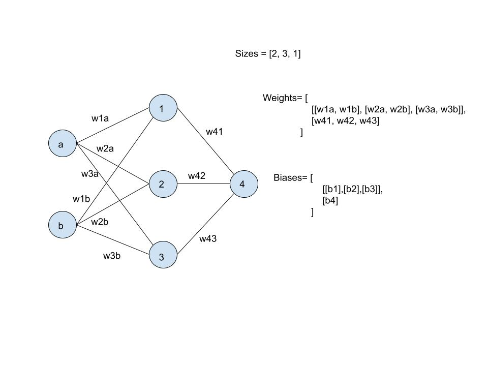

Following [Neural Networks and Deep Learning](http://neuralnetworksanddeeplearning.com/about.html), [Napkin NN](https://sirupsen.com/napkin/neural-net)

Using a [test area](https://colab.research.google.com/drive/1vniPPgYnCg8fG-YuUfk9nM3dalejcls5?usp=sharing)

[Neural Networks from Scratch in Python](https://www.youtube.com/playlist?list=PLQVvvaa0QuDcjD5BAw2DxE6OF2tius3V3)is a good reference but [Neural Network from Scratch | Mathematics & Python code](https://youtu.be/pauPCy_s0Ok?si=jbjNbyIgbHA7vtH1) is what saved my ass.

A neural network is simply a function approximator. This function may be 'average' or 'is a cat'

**Some fun links**:
- [How are memories stored in neural networks?](https://youtu.be/piF6D6CQxUw?si=JlChPRtN9yP659U9)
# Chapter 1
## Perceptrons
A type of neuron; takes _n_ binary inputs and gives 1 binary output

using weights $wi$ (real), activate output if weighted sum > threshold

Layer perceptrons to take outputs of the previous layers, make decisions accordingly

Finally, move 'threshold' to the LHS. A more elegant way to describe a perceptron:
> _0 if $w.x + b <= 0$, 1 otherwise_ 

exactly the step function

**Note:** 
- 'multiple' outputs on perceptron is simply notational convenience. They all carry the same value
- very interesting: implementation of AND gate by having bias 3, weights -2, -2! \[|-4| > 3]. Technically, perceptrons can be used to build circuits
- it is also conventional to show inputs as 'nodes' in themselves
### References:
- Neural Networks and Deep Learning
- https://stackoverflow.com/questions/55838580/how-do-you-properly-implement-and-verify-a-perceptron-gradient-descent-to-lear

## Sigmoid neurons

**Why?**
for learning purposes, we want a small change in any bias to lead to just a small change in the output. This allows us to easily 'adjust' a network over time (for perceptron weights, there may be major shifts; learning for one input might lead to loss of applicability on previously-learnt inputs)

**Major differences**
- inputs need not be binary
- output is $\sigma(w.x + b)$; 
	>$\sigma(x) = 1/ (1 + e^{-z})$ 
	>
	>i.e, output = $= 1/ (1 + e^{-w.x - b})$
- shifts the output range from 'all real numbers' to \[0-1]; smoothed-out step function; means a small change in input will lead to a small change in output
- Similar to perceptron, except when $z$ is not extreme

> $\Delta$ output $\approx \Sigma (\partial$ output$ / \partial wj) + \Delta b (\partial$ output $/ \partial b)$ 

## Activation function
Here, $\sigma$ is an activation function; activation functions are applied to $w.x + b$ to determine, well, activation (output).

If we didn't use them, our network would only be able to approximate linear functions.

Activation function for perceptron => step
							   for sigmoid neuron => $\sigma$
why $\sigma$ ? for the differential properties of exponents. Will be useful later.

Interpretation of output:- up to us! 

Lastly; consider multiplying every weight & bias with c. As c $\rightarrow \infty$  , sigmoid function will behave exactly like the step function; except at 0, where it would output 0.5 rather than the expected 1

### ReLU
another popular activation function. simply chooses $max(0, w.x + b)$. Why use it?
- computational efficiency; exponentials can be expensive
- Avoids vanishing gradient problem (see [[NN - The basics but better#Network]]) & the output is unconstrained
- It just seems to work better
see [stackexchange](https://stats.stackexchange.com/questions/126238/what-are-the-advantages-of-relu-over-sigmoid-function-in-deep-neural-networks)

### Softmax
Based on exponentiation. 
$y = e^x$
we apply the function then normalise the output values.
i.e, 
$Si,j = e^{zi,j} / (\Sigma e^{zi,j})$
to deal with large numbers, first subract the largest input from each input (so now all are < 0)

unlike the previous activations, it applies to the layer's set of outputs (not a single neuron's output)
# Chapter 1.2

## Neural network architecture

### Input layer
the layer of input neurons; pseudo-nodes that always output the required value $x$
### Output layer
The  layer of neurons that produce our output; the last layer
### Hidden layer
Any layer that is not input or output
### MLP
'Multi-layer perceptrons'; any multi-layer neural network
### Feedforward NN
A network that feeds output forward; each output is used as successive input
No loops.
### Recurrent NN
Allows loops. To avoid problems, neurons fire for a limited time, then become quiescent. Leads to a cascade of firing & so output's affect on input is not instantaneous
### Design
- Input and output layers depend on.... our input and output. Takes heuristics & tweaking
- see [[Handwritten digits]]
## Cost/Objective function
Quantifies how well the output matches the target
In terms of weight, bias, output, not accuracy, as we can evaluate this better.
#### MSE
Mean Squared error, aka quadratic cost function

> $C(w, b) = (\Sigma ||y(x) - a||^2) / 2n$
> n -> number of training inputs
> a -> vector output of NN with w, b
> ||v|| -> vector length

Aim - minimise C(w, b)

#### Categorical Cross-Entropy

a.k.a *Softmax Loss*

> $- \Sigma y_{tgt} log(y_{pred}))$
> log - base e

which simplifies to

> $- log(y_{pred}))$
> where y_pred is the confidence with which the target class has been predicted

if using one-hot encoding

## Learning algorithms
used to automatically fine-tune the weights of a network (of neurons)
#### Gradient descent
An optimisation method for unconstrained functions

Keep taking optimised steps in the direction of downward slope (opposite to gradient)

If C is a function of $v = (v1, v2... vn)$
> $\Delta C \approx \nabla C. \Delta v$ 

$\Delta C$ - change in C
$\nabla C$ - gradient of C (at a given point)
$\Delta v$ - amount by which we change each $vi$

choose $\Delta v = -n \nabla C$ , where n is the learning rate. Then, $\Delta C$ always >0

That is, start at random location $v$. Keep moving to a new position $v'$ where 
> $v' = v -n \nabla C$

until we reach a minimum ($v' = v$)

How do we choose $n$?
- if $n$ is too large, the approximation doesn't hold and $\Delta C$ > 0
- if too small, we barely make progress

mathematically, 
> $n = \epsilon / ||\nabla C||$

where $\epsilon$ is the size of a step

Apply gradient descent to a function of weights & biases (which is what a NN is!)

Ignoring all the maths, this just describes a standard gradient descent. Considering weights & biases a vector, simply update every one of them based on the slope at the point, and the learning rate (which we assign)
## Backpropagation!
Now, in mathematics, we optimise an objective function. A method to do this is gradient descent.

How are we defining our objective function? Our (simplest) objective function takes all the weights and biases, and outputs the average error over our entire training set.

Alright now, our gradient descent simply takes a step as per the direction of the gradient. To calculate our gradient, we could do the classroom method, i.e,
 $grad(f(x, y, z)) = (df/dx, df/dy, df/dz)$

but now imagine applying this to every single weight and every single bias of every single neuron! It's computationally expensive and a pain to implement.

Reiterating that gradient descent is simply a method we use to optimise our function. At the end, all we're doing is adjusting inputs to optimise output (in this case, minimise error).

Remember that the activation of a neuron are based on
- its weights
- its biases
- its inputs

For a hidden layer, these inputs, in turn are activations of the previous neurons. 

To improve our output,
- we can improve weights to the (previous) neurons that fire 'correctly' (are active at the right time)
- we can try to increase activations (of the previous layer) whose connection is highly weighted

Keep the second option in mind. Now, think of all the neurons in our output layer! Assuming we don't change the weights (and for a single training example), each neuron has an 'opinion' on how the previous activations should change. 
Let's add up all those 'opinions', and we now get a target of what the activations of the layer _before_ the output layer should look like.

Now we can repeat this reasoning; what is the target for the previous layer, so that the current one will be close to its target?

So what we're doing, essentially, is figuring out the target per layer. Rather than dealing with a humongous, complicated function involving all weights (and biases) ever (and then differentiating this multiple times!) we go backwards to determine the effect of each weight.

> Backpropagation is the algorithm for determining how a single training example would like to 'nudge' the weights and biases ... in terms of what relative proportions to these changes cause the most rapid decrease to cost
> - 3Blue1Brown

Essentially, this gives us the 'step' we should take without actually computing every single derivation.

**Note: we don't need to calculate the error itself, only the derivative**
#### Stochastic gradient descent
Our function $C$ involves the *entire* training set, which is time-consuming. Do we really need the exact error every gradient step we take?

Estimate $\nabla C$ by random sample.  Train in mini-batches (epochs of training). Speeds up the gradient estimation, since we need a general direction to move in, not necessarily an exact value. (That is, instead of using the entire training set at once, split it up). 
This is not entirely accurate for each step; we end up taking more, less accurate steps, but we do it faster (and end up in the same area).

**Note:** when this mini-batch is of size 1, the network looks at one input at a time & takes a step per input. This is _online_, or _incremental_ learning. 
### Dataset
We split our training data into two parts; training and validation. Validation set may be used to adjust hyper-parameters such as learning rate, which is not changed by the learning algorithm.

The training set is further randomised & split up into mini-batches.
# Chapter 1.3

Implementation notes!
### Network
- he uses a Network object, with attributes
	- number of layers
	- sizes; number of neurons per layer
	- biases; a nested tuple per layer \[except for input layer], each inner tuple contains 1 bias
	- weights; a nested tuple per layer; each nest contains nxm weights; 
	> weights\[i] is a matrix where $wjk$ is the weight for j'th node of i+1th layer, k'th node of i'th layer (assuming 1-indexing)

- He uses np.random.randn (Why? It returns a random value from standard normal distribution. [Why?](https://stackoverflow.com/questions/47240308/differences-between-numpy-random-rand-vs-numpy-random-randn-in-python) We're using the sigmoid activation function. The gradients away from 0 are very small, and make low influence ([vanishing gradient](https://en.wikipedia.org/wiki/Vanishing_gradient_problem)), making it untrainable. The range must be close to 0; We could also use Xavier initialisation:- `range [-sqrt(6. / (in + out)), +sqrt(6. / (in + out))]` for a uniform distribution)
- non-standard j, k to simplify vector computation.

See [[Handwritten digits]]

# Hold up
I did not understand what exactly he's implementing in his backpropagation. I'd like to do something more readable so let's rewind and look at other stuff

- [Neural Networks from scratcch in Python](https://www.youtube.com/playlist?list=PLQVvvaa0QuDcjD5BAw2DxE6OF2tius3V3)

He uses the [softmax activation function](#Softmax) in his neurons to help them 'learn' better.

He also does batching in the NN. Essentially, train the network on a batch of inputs at a time for better generalisation (when the size of the batch is 1, this is live or online training)

What about the loss function? Regression uses MAE. Since we're doing classification, and our output is going to be a level of confidence for each output, we're going with [Categorical Cross-Entropy](#Categorical%20Cross-Entropy).

Now, back to learning. The effect of each weight on the result is represented by the gradient.  SGD uses multiple data points to take a gradient step as opposed to one point at a time, which can help it avoid local minima while taking faster steps.
[SGD tutorial](https://youtu.be/IU5fuoYBTAM?si=EUtQjplx8pawSZcQ).

Backpropagation lets us calculate the gradient without actually performing the complex derivations.

[Neural Network from Scratch | Mathematics & Python code](https://youtu.be/pauPCy_s0Ok?si=jbjNbyIgbHA7vtH1)gives the explanation for backpropagation if using MSE (This is my saviour right now). [Here's](https://e2eml.school/softmax)Softmax for neural networks.

[For later](https://stackoverflow.com/questions/41663874/cs231n-how-to-calculate-gradient-for-softmax-loss-function)
# References
- [Neural Networks and Deep Learning](http://neuralnetworksanddeeplearning.com/about.html)
- [Why randomn: stackoverflow](https://stackoverflow.com/questions/47240308/differences-between-numpy-random-rand-vs-numpy-random-randn-in-python)
- [Vanishing gradient problem : wikipedia](https://en.wikipedia.org/wiki/Vanishing_gradient_problem)
- [What is backpropagation really doing? 3Blue1Brown](https://www.youtube.com/watch?v=Ilg3gGewQ5U)
- [Neural Networks and Deep learning: Backpropagation](http://neuralnetworksanddeeplearning.com/chap2.html)

See
- [My scratch area](https://colab.research.google.com/drive/1vniPPgYnCg8fG-YuUfk9nM3dalejcls5?usp=sharing)

Future references
- [Working with neural nets in Haskell](https://itecnote.com/tecnote/haskell-neural-networks-in-haskell-advice/)
- [Efficacy of Haskell for AI](https://aitechbits.com/en/haskell-neural-network/#:~:text=Haskell%20has%20a%20steep%20learning%20curve%2C%20so%20it%20is%20not%20easy%20to%20read%20and%20maintain.%20So%20it%20makes%20it%20difficult%20to%20code%20a%20neural%20network%20in%20Haskell%2C%20even%20though%20it%20is%20an%20ideal%20programming%20language%20to%20code%20neural%20networks.)
- [Neural Networks, types and functional programming](https://colah.github.io/posts/2015-09-NN-Types-FP/)
- [Something to come back to later - Deep learning from the first principles](https://penkovsky.com/neural-networks/)
- [Functional Programming and Intelligent Algorithms](http://www.hg.schaathun.net/FPIA/week03se1.html)
- [Haskell Brain](https://crypto.stanford.edu/~blynn/haskell/brain.html) and [Haskell brain rewrite](http://h2.jaguarpaw.co.uk/posts/refactoring-neural-network/)

Other relevant stuff
- [Effect of hidden layers](https://ieeexplore.ieee.org/document/9318195)